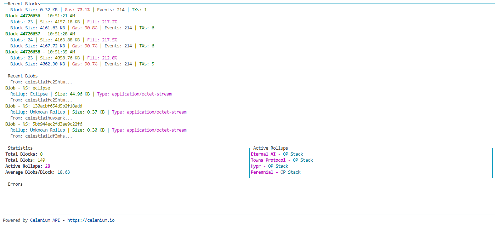

# Blobr - Celestia Rollup Activity Monitor

Blobr is a real-time terminal-based monitor for Celestia rollup activity. It provides live insights into block production, blob submissions, and rollup statistics, helping developers and operators track the health and activity of their rollups on the Celestia network.

## Features

- 📦 Real-time block monitoring with detailed statistics
- 🔄 Live blob tracking across namespaces
- 📊 Active rollup status and metrics
- ⚡ Instant error reporting and logging
- 🎨 Beautiful terminal UI with color-coded information

## Prerequisites

- Node.js v18 or higher
- npm or yarn package manager

## Installation

### For Users
Install globally from npm:
```bash
npm install -g gbarros/blobr
```

Then run:
```bash
blobr watch
```

### For Developers
1. Clone the repository:
```bash
git clone https://github.com/gbarros/celestia-terminal.git
cd celestia-terminal
```

2. Install dependencies:
```bash
npm install
```

3. Build the project:
```bash
npm run build
```

4. Run in development mode:
```bash
npm start
```

## Usage

Run the monitor with default settings (mainnet):
```bash
blobr watch
```

Or with custom options:
```bash
blobr watch --network mocha --filter your-namespace --interval 5000
```

### Command Line Options

- `--network`: Network to monitor (mainnet, mocha, arabica)
- `--filter`: Filter blobs by namespace
- `--limit`: Limit number of blocks to show
- `--interval`: Update interval in milliseconds

## What It Shows

### Blocks
- Block height and timestamp
- Blob count and size
- Block fill rate
- Gas utilization
- Event and transaction counts

### Blobs
- Namespace information
- Associated rollup
- Blob size and content type
- Signer address

### Rollups
- Active rollup list
- Stack information
- Real-time statistics

## Screenshot



## Contributing

Fork this project and extend it for:
- 📊 Custom dashboards
- 🤖 Automated alerts
- 📈 Advanced analytics
- 🔔 Notification systems
- 🌐 Web interfaces

## License

ISC
